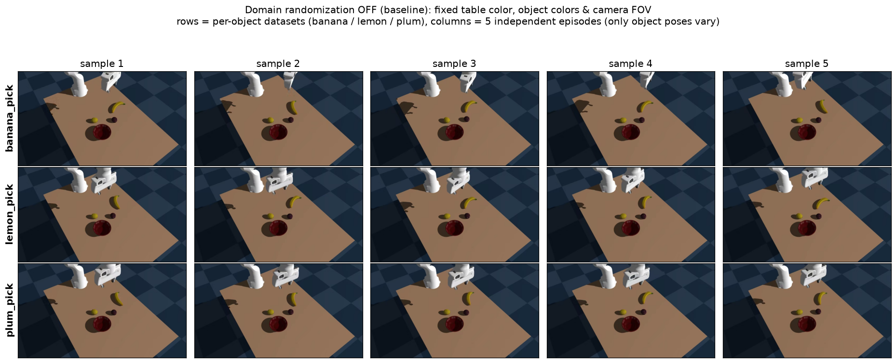
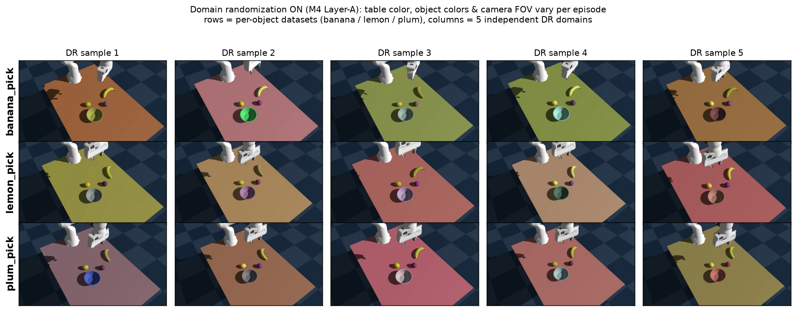
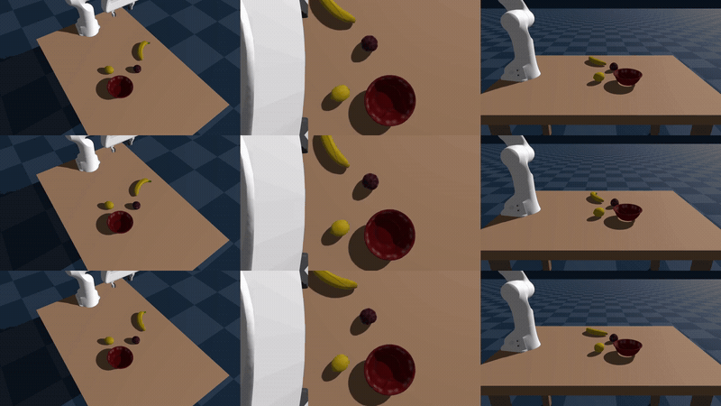

# Franka Fruit-Pick Demo

A compact, end-to-end **reference pipeline** for scripted-to-learned robotic manipulation,
built on the [Genesis](https://github.com/Genesis-Embodied-AI/Genesis) physics engine. A
Franka Panda picks fruit (banana / lemon / plum) off a table and places it into a bowl. The
demo walks the full path from a hand-built scene to a trained, closed-loop visuomotor policy.

> **Note**: This demo is intended purely to show beginners how to run simulation and training
> on an AMD GPU using `genesis-world` and `lerobot`. It is a learning reference — the success
> rate of the final trained model is **not guaranteed**.

## Pipeline (M1 -> M5)


| Stage                                    | What it does                                                                       | Key files                                                                 |
| ---------------------------------------- | ---------------------------------------------------------------------------------- | ------------------------------------------------------------------------- |
| **M1 — Scene**                           | Build the Franka + table + YCB-object scene; verify/populate assets.               | `scene_config.py`, `setup_assets.py`, `build_scene.py`                    |
| **M2 — Scripted policy + randomization** | Per-episode reset randomization and a scripted, IK-based pick-and-place.           | `randomize.py`, `grasp_demo.py`                                           |
| **M3 — Data**                            | Record scripted episodes into a LeRobot dataset; merge per-object sets.            | `record_dataset.py`, `aggregate_datasets.py`                              |
| **M4 — Domain randomization**            | Layer-A (build-time appearance/intrinsics) + Layer-B (runtime physics/extrinsics). | inside `build_scene.py` / `randomize.py` (preview: `tools/dr_preview.py`) |
| **M5 — Train & eval**                    | Train a LeRobot policy, then run closed-loop evaluation and checkpoint sweeps.     | `train_policy.py`, `eval_policy.py`, `eval_sweep.py`                      |


## Repository layout

```
franka_fruit_pick_demo/
  franka_fruit_pick/          # all pipeline code (import + run in place)
    paths.py                  # single source of truth for on-disk layout
    scene_config.py  setup_assets.py  build_scene.py       # M1 (+ M4 Layer-A DR)
    randomize.py     grasp_demo.py                          # M2 (+ M4 Layer-B DR)
    record_dataset.py  aggregate_datasets.py                # M3 data (can record M4-randomized data)
    train_policy.py  eval_policy.py  eval_sweep.py          # M5
    tools/                    # helper / debug / one-off utilities
      motion_probe.py         # scripted-motion quality diagnostics
      dr_preview.py           # domain-randomization visual preview
      scale_ycb.py            # bake scaled copies of YCB meshes (dev-only)
  assets/                     # bundled meshes / robot model (see below)
  datasets/                   # recorded / aggregated LeRobot datasets
  outputs/                    # generated eval results, videos, frames (gitignored)
```

All scripts use flat sibling imports and add the package directory to `sys.path`
themselves, so you can run any of them directly from the repo root — no `pip install`
step is required to run the demo.

## Quickstart

```bash
# 1. Install dependencies (physics engine + demo deps)
#    Requires Python 3.12 (matches the ROCm torch wheels below).
cd franka_fruit_pick_demo
uv sync

# 2. Install a policy backend for M5
#    This project runs on an AMD Radeon (ROCm) GPU — use the prebuilt ROCm 7.2.1 wheels (Python 3.12):
wget https://repo.radeon.com/rocm/manylinux/rocm-rel-7.2.1/torch-2.9.1%2Brocm7.2.1.lw.gitff65f5bc-cp312-cp312-linux_x86_64.whl
wget https://repo.radeon.com/rocm/manylinux/rocm-rel-7.2.1/torchvision-0.24.0%2Brocm7.2.1.gitb919bd0c-cp312-cp312-linux_x86_64.whl
wget https://repo.radeon.com/rocm/manylinux/rocm-rel-7.2.1/triton-3.5.1%2Brocm7.2.1.gita272dfa8-cp312-cp312-linux_x86_64.whl
wget https://repo.radeon.com/rocm/manylinux/rocm-rel-7.2.1/torchaudio-2.9.0%2Brocm7.2.1.gite3c6ee2b-cp312-cp312-linux_x86_64.whl

uv pip uninstall torch torchvision triton torchaudio
uv pip install \
    torch-2.9.1+rocm7.2.1.lw.gitff65f5bc-cp312-cp312-linux_x86_64.whl \
    torchvision-0.24.0+rocm7.2.1.gitb919bd0c-cp312-cp312-linux_x86_64.whl \
    torchaudio-2.9.0+rocm7.2.1.gite3c6ee2b-cp312-cp312-linux_x86_64.whl \
    triton-3.5.1+rocm7.2.1.gita272dfa8-cp312-cp312-linux_x86_64.whl

uv pip install "lerobot[smolvla]==0.4.4"

# 3. Verify assets are in place (M1)
uv run python franka_fruit_pick/setup_assets.py

# 4. Smoke-test the scene (renders one frame per camera)
uv run python franka_fruit_pick/build_scene.py --steps 50 --save-frames
```

### Run the pipeline

#### 1. Record data (M3)

Record scripted episodes into a per-object LeRobot dataset:

```bash
uv run python franka_fruit_pick/record_dataset.py --episodes 50 --pick 011_banana --repo-id demo/banana_pick
uv run python franka_fruit_pick/record_dataset.py --episodes 50 --pick 014_lemon --repo-id demo/lemon_pick
uv run python franka_fruit_pick/record_dataset.py --episodes 50 --pick 018_plum --repo-id demo/plum_pick
```

Sample frames recorded with basic setting:




Optionally record with **domain randomization** (M4) enabled:

```bash
uv run python franka_fruit_pick/record_dataset.py --episodes 50 --pick 011_banana --repo-id demo/banana_pick_dr --dr-appearance --dr-object-color --dr-table-jitter 0.15 --dr-fov-jitter 2.0 --dr-rebuild-every 5 --dr-runtime --dr-friction 0.6 1.4 --dr-mass 0.8 1.2 --dr-cam-pos 0.01 --dr-cam-lookat 0.02
```

Sample frames recorded with domain randomization enabled:



Optionally merge per-object datasets into one training set:

```bash
uv run python franka_fruit_pick/aggregate_datasets.py \
    --dataset-root datasets/banana_pick --dataset-root datasets/lemon_pick \
    --dataset-root datasets/plum_pick   --out datasets/fruit_pick
```

#### 2. Train (M5)

Train a LeRobot policy on the recorded dataset:

```bash
uv run python franka_fruit_pick/train_policy.py smolvla --repo-id demo/fruit_pick --dataset-root datasets/fruit_pick
```

#### 3. Evaluate (M5)

Run closed-loop evaluation, then sweep checkpoints:

```bash
# eval_policy.py takes --policy-path (a single checkpoint dir, containing config.json + model.safetensors)
uv run python franka_fruit_pick/eval_policy.py --policy-path <train-out>/checkpoints/last/pretrained_model --repo-id demo/fruit_pick --dataset-root datasets/fruit_pick --episodes 50 --pick 011_banana 014_lemon 018_plum --save-video

# eval_sweep.py takes --run-dir (the training run dir, containing checkpoints/) and evaluates every checkpoint
uv run python franka_fruit_pick/eval_sweep.py  --run-dir <train-out> --repo-id demo/fruit_pick --dataset-root datasets/fruit_pick --pick 011_banana 014_lemon 018_plum
```

Example closed-loop rollout of the trained policy:



## Assets & datasets

- `**assets/**` is bundled so the scene runs out of the box. `setup_assets.py` is idempotent:
if the required meshes / robot model are already present it does nothing; otherwise it tries
to populate them from local source datasets (development only).
- `**datasets/**` holds recorded and aggregated LeRobot datasets. It ships empty; recording
writes new datasets here (`datasets/<repo-name>/`).
- Both directories hold **large binaries**. If you push them to GitHub, use
[git-lfs](https://git-lfs.com/) or host them separately and document the download step.

## Notes

- `**outputs/`** (eval results, videos, scripted-demo frames) is generated and gitignored.

## Credits & asset sources

The assets bundled under `assets/` are **not original to this repo**; they are sourced from
the following projects and remain under their respective licenses:

- **Franka Panda robot model** — from the [Genesis](https://github.com/Genesis-Embodied-AI/Genesis)
  physics engine's bundled assets.
- **YCB object meshes** (banana / lemon / plum / bowl / etc.) — from the
  [ManiSkill](https://github.com/haosulab/ManiSkill) dataset, originally part of the
  [YCB Object and Model Set](https://www.ycbbenchmarks.com/).

Please refer to the upstream projects for their original licenses and citation requirements
if you redistribute or build on these assets.

